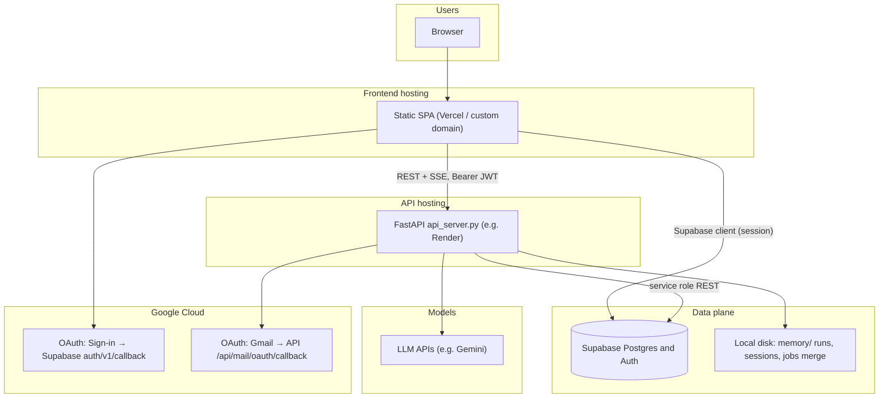
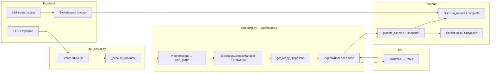
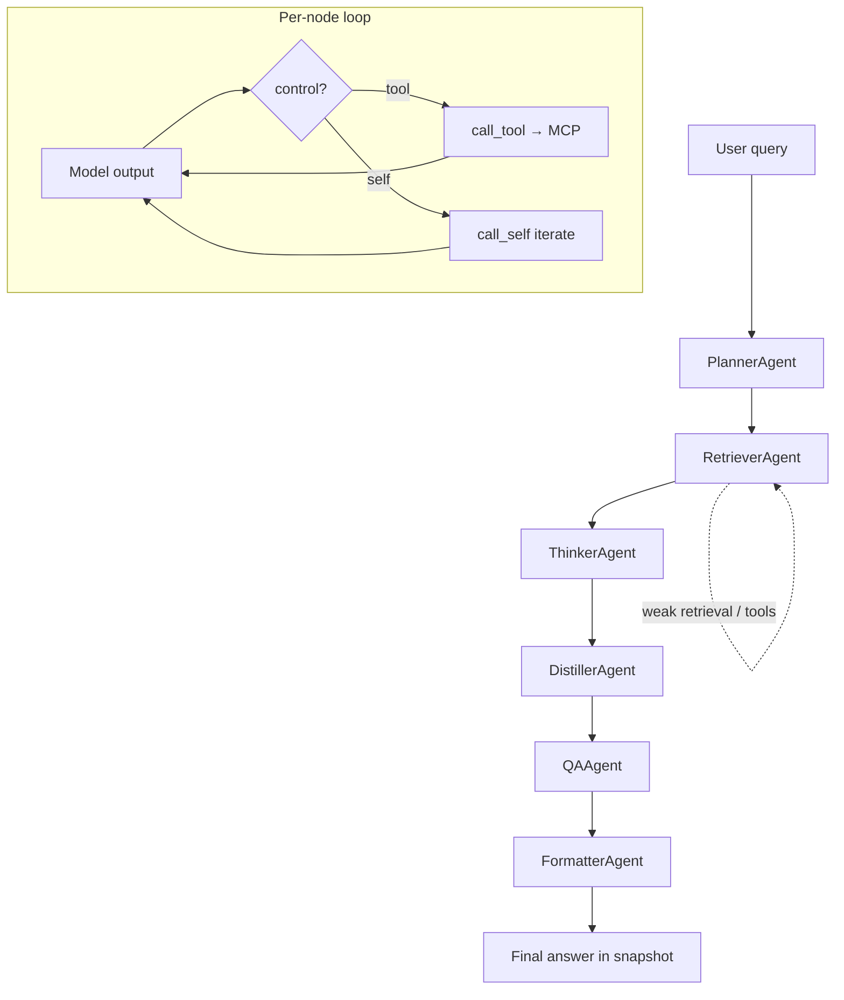
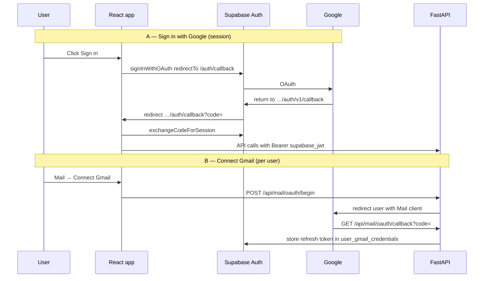

# Arc Reactor

**Arc Reactor** is a production-oriented **multi-agent research system** built around a **directed acyclic graph (DAG)**. Users ask complex questions; a **Planner** turns them into an executable graph of specialized agents (retrieve, reason, distill, QA, format). The stack is **FastAPI** + **React / React Flow** + **MCP tool servers**, with optional **Supabase** persistence and **per-user Gmail**.

For a **code navigation map** (where to edit what), see **[`AGENT_README.md`](./AGENT_README.md)**.

---

## Demos

- **Demo 1:** [Google Drive](https://drive.google.com/file/d/1vt172Q0vzhBNi5NEmVYDxuZcMlvBef92/view?usp=sharing)  
- **Demo 2:** [YouTube](https://youtu.be/wYQjWFYDFOg)

---

## Table of contents

- [Features](#features)
- [Architecture (diagrams)](#architecture-diagrams)
- [What this system does](#what-this-system-does)
- [Execution lifecycle](#execution-lifecycle-step-by-step)
- [Core data contracts](#core-data-contracts)
- [Storage and persistence](#storage-and-persistence-modes)
- [Frontend](#frontend-architecture)
- [Authentication](#authentication-model)
- [API surface](#api-endpoints)
- [Configuration](#configuration)
- [Run locally](#run-locally)
- [Deploy (Render + Supabase + Vercel)](#render--supabase--vercel)
- [Project structure](#project-structure)
- [Troubleshooting](#troubleshooting)

---

## Features

| Area | What you get |
|------|----------------|
| **Agent run** | Planner-first DAG; parallel execution of ready steps; live graph in **React Flow**. |
| **Streaming** | **SSE** with short-lived stream tickets; snapshot hydration on connect. |
| **Inspector** | **Preview** / **Rendered** / **JSON** / **Web URLs** tabs; markdown rendering with GFM. |
| **Clarification** | Pipeline can pause for user input; resume via clarification API. |
| **Research follow-up** | **Formatter follow-up** appends a new subgraph in the **same** run for “tell me more” style queries. |
| **MCP tools** | Browser, retrieval, sandbox-style tooling via **MultiMCP** (`mcp_servers/`). |
| **Scheduler** | Cron / interval **scheduled jobs**; server-built `built_query`; **run now** from UI. |
| **Notepad** | Per-user notes (folders + markdown files); cloud table when Supabase store is enabled. |
| **Mail** | **Per-user Gmail OAuth**; connect/disconnect; list/read/send/reply (not a shared server mailbox). |
| **Auth** | **Supabase** JWT for signed-in users; **guest** mode with run quota (limited runs, no Mail/scheduler cloud features that require full account). |
| **Persistence** | **Local** JSON under `memory/` and/or **Supabase** (`chat_runs`, jobs, notepad, Gmail credentials) depending on env. |

---

## Architecture (diagrams)

### 1) System context — who talks to whom

High-level view: browser, static frontend host, API on Render, Supabase, LLM, and Google (sign-in + optional Gmail).



### 2) Single research run — request to completion

Logical path from “user sends query” to “UI shows final graph.”



### 3) DAG execution inside one run (mental model)

How nodes relate; not every run uses every agent — the **Planner** chooses the graph.



### 4) Authentication flows (two different Google OAuth uses)

**Sign-in** goes through Supabase; **Mail** uses your API’s OAuth callback — different redirect URIs in Google Cloud.



---

## What this system does

- Turns a natural-language **query** into a **DAG** of agent steps (Planner-first).
- Runs **independent** steps in **parallel** when dependencies are satisfied.
- Supports **tool calls** (`call_tool`) and **iteration** (`call_self`) inside a node until it completes.
- Streams **live snapshots** to the UI over **SSE**.
- Persists **run history** and supports **scheduled** re-runs, **notepad**, and **optional Gmail**.

---

## Execution lifecycle (step-by-step)

### 1) Run creation

- `POST /api/runs` validates auth, creates `run_id`, seeds `RUNS[run_id]`, persists metadata (per `LOCAL_RUN_STORE` / Supabase), starts `_execute_run` as a background task.

### 2) Bootstrap + planning

- `AgentLoop4` initializes MCP and asks **PlannerAgent** for a `plan_graph` (nodes, edges, reads/writes).
- Graph is loaded into **NetworkX** via `ExecutionContextManager`.

### 3) DAG execution

- Scheduler repeatedly calls `get_ready_steps()`.
- Ready nodes run concurrently; each may finish, call tools, or self-loop.

### 4) Dataflow

- `mark_done` writes outputs into `globals_schema` under declared **writes** keys.
- Downstream nodes read only their **reads** keys.

### 5) Live streaming

- Client obtains a stream ticket, opens `EventSource` on `/api/runs/{id}/events`.
- Server emits `run_update`, `run_complete`, `run_error`.

### 6) Completion

- Success or failure is reflected in status, persisted, and streamed.

---

## Core data contracts

### Run state (`RUNS[run_id]`)

`query`, `status`, `summary`, `snapshot`, `session_id`, `owner_user_id`, `subscribers` (SSE), optional `pending_clarification`, `activity`.

### Snapshot (API / UI)

`run_id`, `query`, `status`, `nodes[]`, `links[]`, `globals_schema`, `session_id`, etc.

### Node output

Model-dependent JSON: content fields, `call_tool` / `call_self` controls, telemetry.

---

## Storage and persistence modes

| Mode | Behavior |
|------|----------|
| **Local runs** | `LOCAL_RUN_STORE=1` → run list/detail primarily from `memory/local_runs/`. |
| **Supabase** | With URL + service role and `LOCAL_RUN_STORE` off → `chat_runs`, `app_users`, `app_logs`, plus scheduler/notepad tables when migrations are applied. |
| **Guests** | `sub` like `guest:…` is not a DB UUID; guest run listing uses **local** run files only (no Supabase row query for that id). |
| **Session files** | `SAVE_LOCAL_SESSIONS` controls extra session graph files under `memory/session_summaries_index/`. |

Migrations live in **`db/migrations/`** (including scheduled jobs, `user_gmail_credentials`, `user_notepad`).

---

## Frontend architecture

- **Vite + React** in `frontend/`.
- **Routes:** home, login, **`/auth/callback`** (OAuth code exchange), **`/agent`** (gated app).
- **Agent:** run list, React Flow graph, inspector tabs (**Preview / Rendered / JSON / Web URLs**), SSE.
- **Notepad:** tabbed editor, autosave to API.
- **Mail:** Gmail status, connect/disconnect, threads (per linked account).
- **Scheduler:** job cards, **Run now**, cron/interval editing.
- **Env (build time):** `VITE_SUPABASE_URL`, `VITE_SUPABASE_ANON_KEY`, `VITE_API_BASE_URL`.

---

## Authentication model

- **Signed-in users:** Supabase access token → `Authorization: Bearer` → verified in `auth.py` (HS256 / JWKS per config).
- **Guests:** server-minted JWT (`/api/auth/guest`); quota in `guest_quota.py`.
- **Full account required** for Mail link, scheduler create, and other routes that call `require_full_account`.

See **`AGENT_README.md` §18** for Supabase **Redirect URLs** (`/auth/callback`) vs Gmail **redirect URI** on the API.

---

## API endpoints

### Core

- `GET /api/health` — liveness.
- `GET /api/me` — user + guest quota info.
- `POST /api/auth/guest` — guest session token.

### Runs

- `GET /api/runs`, `GET /api/runs/{id}`, `POST /api/runs`
- `POST /api/runs/{id}/stream-ticket`, `GET /api/runs/{id}/events` (SSE)
- `POST /api/runs/{id}/clarification`, `POST /api/runs/{id}/formatter-followup`

### Notes, mail, scheduler

- `GET/POST /api/notes`, `PUT/DELETE /api/notes/{id}`
- `GET /api/mail/status`, `POST /api/mail/oauth/begin`, `GET /api/mail/oauth/callback`, `DELETE /api/mail/link`, plus mail message/send/reply routes
- `GET/POST/PATCH/DELETE /api/scheduled-jobs`, `POST …/run-now`

### Admin

- `GET /api/admin/logs` (allowlisted user IDs)

---

## Configuration

- **`config/agent_config.yaml`** — agents, prompts, models, MCP attachment.
- **`config/models.json`**, **`config/mcp_server_config.yaml`**, **`prompts/*.md`**.

### Environment (high level)

- **API:** `SUPABASE_*`, `GEMINI_API_KEY` (or other model keys), `LOCAL_RUN_STORE`, `SAVE_LOCAL_SESSIONS`, `RUN_TIMEOUT_SEC`, `CORS_ORIGINS`, `GMAIL_OAUTH_REDIRECT_URI`, `MAIL_OAUTH_SUCCESS_URL`, `ADMIN_USER_IDS`, …
- **Frontend build:** `VITE_SUPABASE_URL`, `VITE_SUPABASE_ANON_KEY`, `VITE_API_BASE_URL`

See **`.env.example`** and **`docs/RENDER_SUPABASE_LOCAL_FRONTEND_SETUP.md`**.

---

## Run locally

### Backend

```bash
uv run python -m uvicorn api_server:app --host 127.0.0.1 --port 8000 --reload
```

### Frontend

```bash
cd frontend
npm install
npm run dev
```

Open **`http://localhost:5173`**. Point **`VITE_API_BASE_URL`** at **`http://127.0.0.1:8000`** in the project root `.env`.

---

## Render + Supabase + Vercel

- Step-by-step hybrid setup: **`docs/RENDER_SUPABASE_LOCAL_FRONTEND_SETUP.md`**
- **Render:** Python web service, env vars, optional **Secret File** for `credentials.json` (Gmail Web client).
- **Vercel:** build `frontend/` with the `VITE_*` variables; production branch e.g. **`main`**.
- **Supabase:** run SQL from **`db/migrations/`**; configure **Redirect URLs** for **`https://<your-domain>/auth/callback`**.

---

## Project structure

```text
S8 Share/
├── agents/              # Agent runner, execution
├── config/              # YAML + JSON config
├── core/                # AgentLoop4, model manager, utilities
├── db/migrations/       # Supabase SQL migrations
├── docs/                # Deploy / setup notes
├── frontend/            # Vite React app (src/App.jsx, auth, Mail, Scheduler, …)
├── memory/              # Local persistence (gitignored subsets)
├── mcp_servers/         # MCP implementations + multi_mcp router
├── prompts/             # Markdown prompts per agent
├── tools/               # Sandbox helpers
├── api_server.py        # FastAPI app, routes, SSE, scheduler lifespan
├── auth.py              # JWT verification
├── scheduler_service.py # built_query for scheduled subjects
├── guest_quota.py       # Guest run limits
├── lib/                 # gmail_api, gmail_oauth helpers
└── AGENT_README.md      # Developer / agent onboarding map
```

---

## Troubleshooting

| Symptom | Things to check |
|---------|------------------|
| **401/403** | JWT secret / issuer / audience match Supabase; `Authorization` header present. |
| **Login loop after Google** | Supabase **Redirect URLs** include full **`…/auth/callback`**; Google OAuth client used in Supabase is **enabled**; Vercel build has correct `VITE_SUPABASE_*`. |
| **CORS errors** | `CORS_ORIGINS` on API includes exact frontend origin (**no trailing slash**). |
| **Guest + “CORS” on `/api/runs`** | Often a **500** behind the scenes; guests must not hit Supabase with `guest:…` as UUID (fixed in server logic — use latest `main`). |
| **Mail “not configured”** | `credentials.json` on server (or secret file on Render); `GMAIL_OAUTH_REDIRECT_URI` matches Google Cloud. |
| **SSE fails** | Run still active; valid stream ticket; `VITE_API_BASE_URL` correct. |
| **Formatter looks empty** | Use **JSON** tab; renderer may be picking a metadata key instead of the rich content field. |

---

*Arc Reactor — multi-agent DAG research assistant.*
